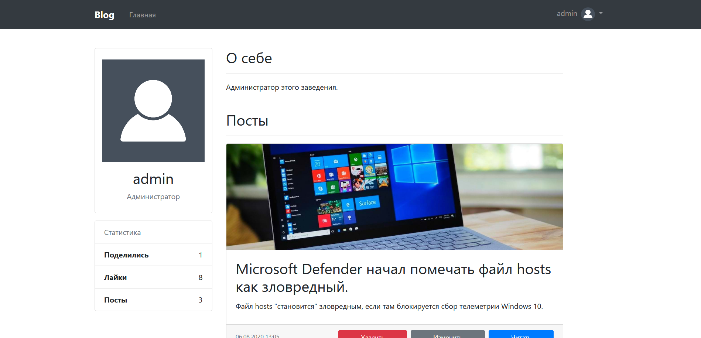

<h1 align="center">Personal Blog</h1>

---

## Description
Personal Blog on Flask

### Supports 
* Comments
* Likes
* Share
* Filter posts by date
* Show related posts
	* Based on likes amount
* Profile editing
	* Avatar
	* Bio
* Privalage seperating
	* Confirmed users can comment/like posts
	* Another admin can't edit/delete the posts of another
* Post's time converting

### To-Do
1. Make available full-text search.
2. Add comments to the code.
3. Add mobile view support
4. Ban users
5. Delete comments

## Screenshots

## Requirements
Package | Version
------------ | -------------
Flask | 1.1.2
Flask-Login | 0.5
Flask-Migrate | 2.5.3
Flask-Moment | 0.1
Flask-Mail | 0.9.1
Flask-SQLAlchemy | 2.4.3
email-validator | 1.1.1
Flask-WTF | 0.14.3

## Contacts
[Telegram ✈️](https://t.me/fdnflm)

[Email](mailto:fadinflame@gmail.com?subject=FlaskBlog[?])

